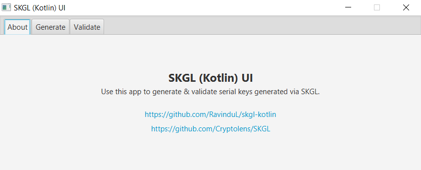
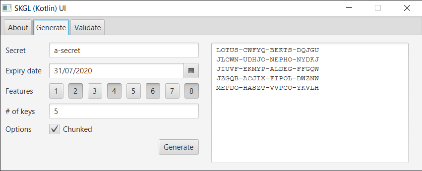
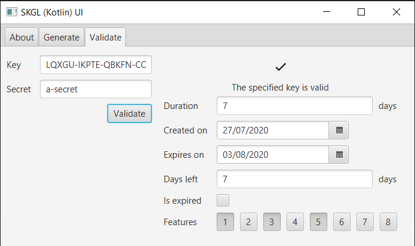

# SKGL (Kotlin)

The [SKGL](https://github.com/Cryptolens/SKGL) library, written in Kotlin, with a shiny new API. Use this to generate & validate human readable, 20-character serial keys with up to 8 features embedded.

**Please note: this library is still a work-in-progress.**

<br>

## Usage

Please refer to [`sandbox/Program.kt`](sandbox/src/main/kotlin/com/example/program/Program.kt) for more examples.

### Generate a Key

```kotlin
val key = SerialKey.build("a-secret") {
	features = setOf(1, 3, 5)
	duration = 10
	chunked = true
}

println(key.text) // XXXXX-XXXXX-XXXXX-XXXXX
```

### Decode a Key

```kotlin
val key = SerialKey("XXXXX-XXXXX-XXXXX-XXXXX", "a-secret")

val createdOn = key.createdOn
val expiresOn = key.expiresOn
val hasFeature1 = 1 in key.features
val isExpired = key.calculateIsExpired()
val daysLeft = key.calculateDaysLeft()
```

<br>

## UI Usage

The [TornadoFX](https://tornadofx.io/)-powered [skgl-ui](skgl-ui) project can be used to generate or validate keys,







